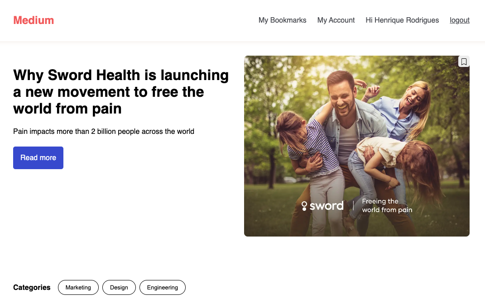

# Medium Front

## Functionalities

home
- List of articles;
- Filter articles by category;
- Load more articles;
- Save the article to read later;
- Access the full article;

My Bookmarks
- Article listing;
- Remove article;
- Access the full article;

Article
- View the full article;

My Account
- Select the user profile;
- List of articles created ('If you are admin you can view all articles');
- Access the article edit page;
- Delete an article;
- Access the page to create a new article;

New Article
- Register a new article;

Edit Article
- Edit a created article;

Login
- Log in or create an account on the Auth0 platform;

##### Scripts

In the project directory, you can run:

Installing the dependencies

`npm run install`

Running the local project

`npm run start`

Running the project build:

`npm run build`

Running application tests

`npm run test`

`npm run test:coverage`

`npm run test:nowatch`

Running code quality

`npm run lint`

`npm run lintFix`

`npm run format`

Api mock

https://mockapi.io/

##### What was used in the project
Create react app: used to create the project structure react
To ensure the quality of the code was used:
- eslint
- prettier
- husky

For the tests, we used:

- React test library
- jest-styled-components

For stylization of the component was used:
- styled-components

##### Husky 
At commit time, the test and lint command is run to ensure that nothing was broken during development.

##### How to contribute to the project

- Clone the project to your machine;
- Install the project's dependencies with the `npm install` command;
- Create a branch for your changes;
- Run the project following the orientation of the script part of this readme;
- After making the changes, run the test commands to ensure that nothing was broken;
- Open a pull-request for the main branch;

